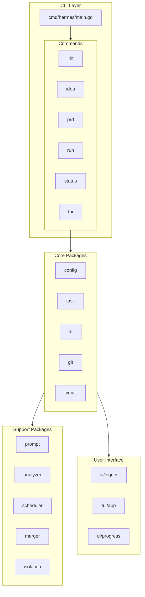
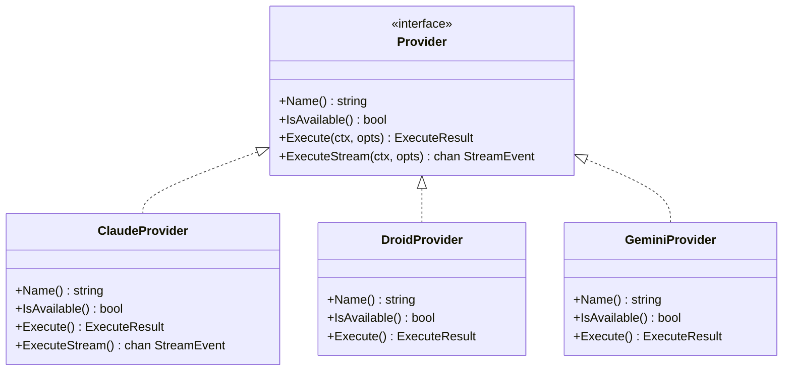
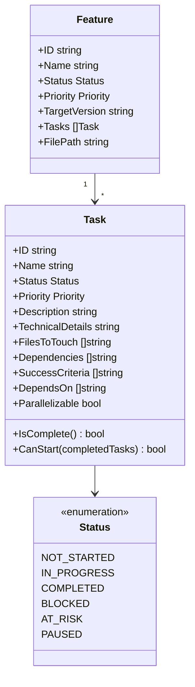
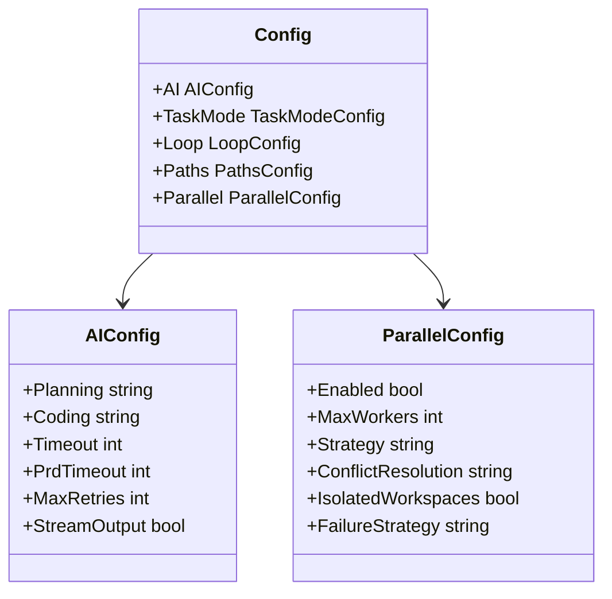
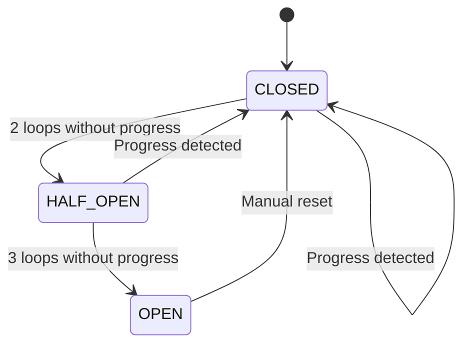
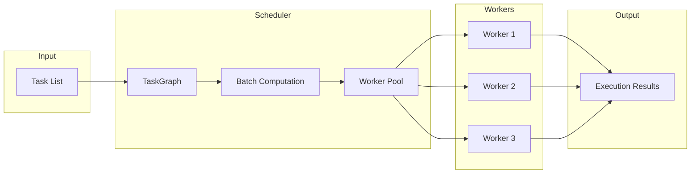
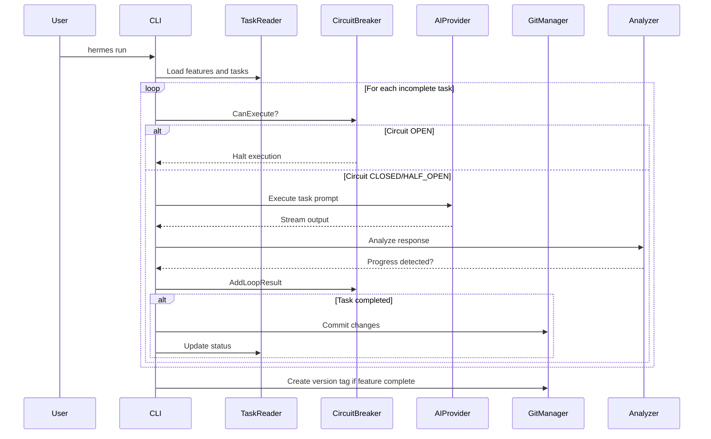
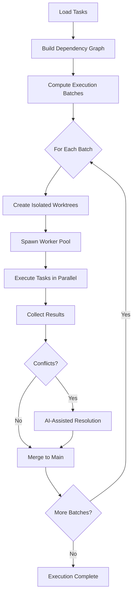
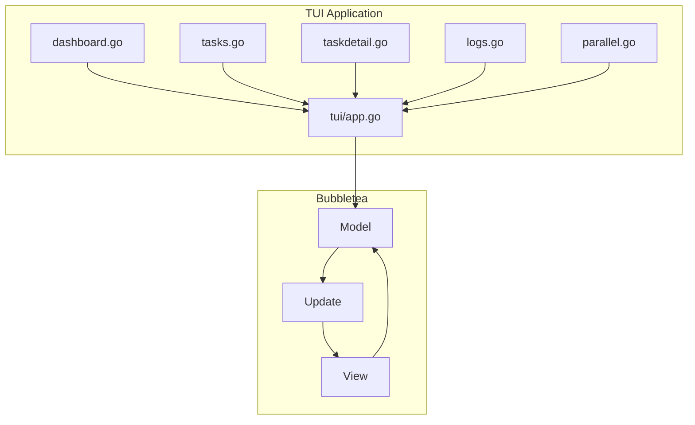

# Hermes Architecture Overview

## Project Summary

**Hermes** is an AI-powered autonomous application development system written in Go. It orchestrates AI CLIs (Claude, Droid, Gemini) in a task-driven development loop with automatic branching, circuit breaker protection, and parallel execution capabilities.

## High-Level Architecture



## Package Structure

```
hermes/
├── cmd/hermes/main.go          # Single binary entry point with Cobra CLI
├── internal/
│   ├── ai/                     # AI provider abstraction layer
│   ├── analyzer/               # Response and feature analysis
│   ├── circuit/                # Circuit breaker pattern implementation
│   ├── cmd/                    # Cobra subcommand implementations
│   ├── config/                 # Configuration management with Viper
│   ├── git/                    # Git operations - branch, commit, tag
│   ├── idea/                   # Idea-to-PRD generation
│   ├── installer/              # System-wide installation
│   ├── isolation/              # Git worktree workspace isolation
│   ├── merger/                 # AI-assisted merge conflict resolution
│   ├── prompt/                 # PROMPT.md injection and templates
│   ├── scheduler/              # Parallel task execution scheduler
│   ├── task/                   # Task parsing and management
│   ├── tui/                    # Interactive terminal UI with Bubbletea
│   ├── ui/                     # Logging, tables, progress display
│   └── updater/                # GitHub-based auto-updates
├── docs/                       # User documentation
├── logs/                       # Development logs
└── plan/                       # Implementation phase plans
```

---

## Core Components

### 1. AI Provider Layer ([`internal/ai/`](internal/ai/provider.go))

The AI subsystem provides a unified interface for multiple AI CLI backends.



**Key Files:**
- [`provider.go`](internal/ai/provider.go:8) - [`Provider`](internal/ai/provider.go:8) interface definition
- [`claude.go`](internal/ai/claude.go) - Claude CLI implementation using SDK
- [`droid.go`](internal/ai/droid.go) - Droid CLI wrapper
- [`gemini.go`](internal/ai/gemini.go) - Gemini CLI wrapper
- [`executor.go`](internal/ai/executor.go) - Task execution with streaming support

**Provider Priority:** Claude > Droid > Gemini

---

### 2. Task Management ([`internal/task/`](internal/task/types.go))

Handles parsing and managing task files in Markdown format.



**Key Files:**
- [`types.go`](internal/task/types.go:26) - [`Feature`](internal/task/types.go:26) and [`Task`](internal/task/types.go:43) structs
- [`parser.go`](internal/task/parser.go) - Markdown parsing with regex
- [`reader.go`](internal/task/reader.go) - File reading and status checking
- [`status.go`](internal/task/status.go) - Status update operations

---

### 3. Configuration ([`internal/config/`](internal/config/types.go))

Hierarchical configuration using Viper with JSON files.



**Configuration Priority:** CLI flags > Project config > Global config > Defaults

**Key Files:**
- [`types.go`](internal/config/types.go:4) - [`Config`](internal/config/types.go:4) struct definitions
- [`config.go`](internal/config/config.go) - Loading and merging logic
- [`defaults.go`](internal/config/defaults.go) - Default values

---

### 4. Circuit Breaker ([`internal/circuit/`](internal/circuit/breaker.go))

Implements the circuit breaker pattern to prevent runaway execution.



**States:**
| State | Description |
|-------|-------------|
| CLOSED | Normal operation - execution allowed |
| HALF_OPEN | Monitoring - 2 consecutive no-progress loops |
| OPEN | Halted - requires `hermes reset` command |

**Key Files:**
- [`breaker.go`](internal/circuit/breaker.go:17) - [`Breaker`](internal/circuit/breaker.go:17) implementation
- [`state.go`](internal/circuit/state.go) - State constants and types

---

### 5. Parallel Scheduler ([`internal/scheduler/`](internal/scheduler/scheduler.go))

Manages parallel task execution with dependency resolution.



**Key Components:**
- [`Scheduler`](internal/scheduler/scheduler.go:16) - Main orchestrator
- [`TaskGraph`](internal/scheduler/graph.go) - DAG for dependency resolution
- [`WorkerPool`](internal/scheduler/pool.go) - Concurrent worker management
- [`PriorityQueue`](internal/scheduler/priority.go) - Task prioritization

**Key Files:**
- [`scheduler.go`](internal/scheduler/scheduler.go:16) - [`Scheduler`](internal/scheduler/scheduler.go:16) struct
- [`graph.go`](internal/scheduler/graph.go) - Dependency graph with topological sort
- [`pool.go`](internal/scheduler/pool.go) - Worker pool implementation
- [`rollback.go`](internal/scheduler/rollback.go) - Snapshot and recovery

---

### 6. Git Operations ([`internal/git/`](internal/git/git.go))

Handles all Git interactions for feature branches and commits.

**Capabilities:**
- Feature branch creation: `feature/FXXX-name`
- Conventional commits: `feat(component): message`
- Auto-tagging on feature completion with `TargetVersion`
- Parallel branch management with worktrees

**Key Files:**
- [`branch.go`](internal/git/branch.go) - Branch creation and switching
- [`commit.go`](internal/git/commit.go) - Commit operations
- [`parallel.go`](internal/git/parallel.go) - Worktree management for parallel execution

---

## Execution Flow

### Task Execution Loop



### Parallel Execution Flow



---

## Data Flow

### Project Directory Structure

```
my-project/
├── .hermes/                    # Hermes data directory
│   ├── config.json             # Project configuration
│   ├── PROMPT.md               # AI prompt - auto-managed
│   ├── circuit-state.json      # Circuit breaker state
│   ├── circuit-history.json    # State transition history
│   ├── tasks/                  # Task markdown files
│   │   ├── F001-auth.md
│   │   └── F002-api.md
│   ├── logs/                   # Execution logs
│   │   └── 2024-01-01.log
│   └── docs/                   # PRD documents
│       └── PRD.md
└── ... project source files
```

---

## TUI Architecture

The interactive TUI uses the Elm architecture via Bubbletea.



**Screens:**
| Key | Screen | Description |
|-----|--------|-------------|
| 1 | Dashboard | Overview with progress stats |
| 2 | Tasks | Task list with status |
| 3 | Logs | Execution log viewer |
| ? | Help | Keyboard shortcuts |

---

## Key Dependencies

| Package | Purpose |
|---------|---------|
| `github.com/spf13/cobra` | CLI framework |
| `github.com/spf13/viper` | Configuration management |
| `github.com/charmbracelet/bubbletea` | TUI framework |
| `github.com/charmbracelet/lipgloss` | TUI styling |
| `github.com/charmbracelet/bubbles` | TUI components |
| `github.com/fatih/color` | Colored console output |

---

## Build and Test

| Command | Description |
|---------|-------------|
| `build.bat` or `make build` | Build for current platform |
| `build.bat test` or `make test` | Run tests with coverage |
| `build.bat build-all` | Build for all platforms |
| `go test ./...` | Run all tests |
| `go test -v ./internal/task` | Test specific package |

**Output:** `bin/hermes-{os}-{arch}[.exe]`

---

## Version History

| Version | Feature |
|---------|---------|
| v1.0.0 | Initial Go rewrite |
| v1.1.0 | Idea-to-PRD generation |
| v1.2.0 | Auto git tagging |
| v1.2.1 | Stream output support |
| v1.2.2 | Auto-update command |
| v2.0.0 | Parallel execution, system installer |
